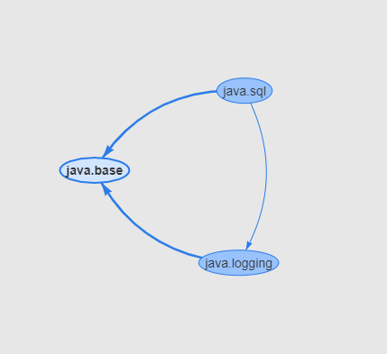
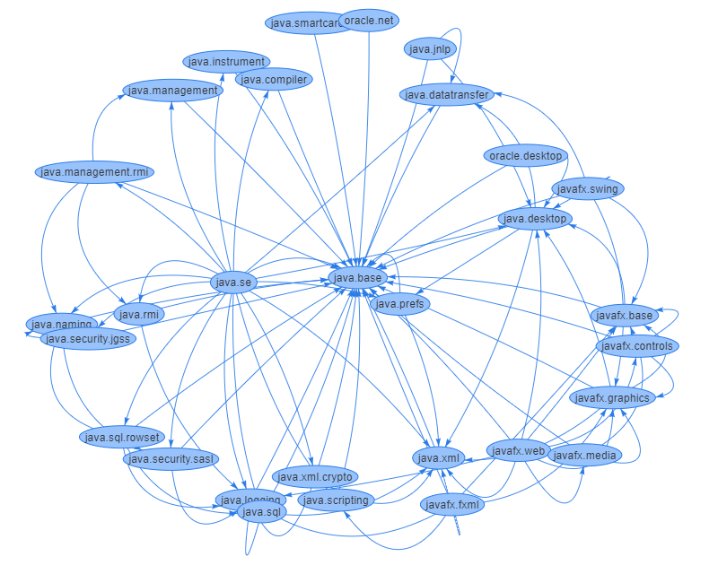

== How to Visualize Jigsaw Module Graph

This is a demo to show how can we visualize Jigsaw module graph in a Java application.

Module API can list Jigsaw modules and its dependents like below.

[source,java]
----
Set<Module> modules = ModuleLayer.boot().modules();
Set<Requires> requires = module.getDescriptor().requires();
----

With these two simple command, we can create a module relation graph in Java side.

To visualize this module relation, I prefered http://visjs.org/[visjs]. With visjs we can create network graphs like below.

[source,javascript]
----
// create an array with nodes
  var nodes = new vis.DataSet([
    {id: 'java.base', label: 'java.base'},
    {id: 'java.logging', label: 'java.logging'},
    {id: 'java.sql', label: 'java.sql'}
  ]);

  // create an array with edges
  var edges = new vis.DataSet([
    {from: 'java.sql', to: 'java.base'},
    {from: 'java.sql', to: 'java.logging'},
    {from: 'java.logging', to: 'java.base'}
  ]);

  // create a network
  var container = document.getElementById('mynetwork');
  var data = {
    nodes: nodes,
    edges: edges
  };
  var options = {};
  var network = new vis.Network(container, data, options);
----

The view should be like below.

As we see, we can create network graph like above.

Let's create whole alive module graph visualizer.

[source,java]
.Node.java
----
public class Node {
    private String id;
    private String label;

    // getters, setters, constructors
----

Node.java represents Node data. Each module name will have one node.

[source,java]
.Edge.java
----
public class Edge {
    private String from;
    private String to;

    // getters, setters, constructors
----

Edge.java represents edge between two node.

[source,java]
.ModuleGraphController.java
----
@RestController
public class ModuleGraphController {

    @GetMapping("/modules")
    public Map<String, HashSet<?>> moduleInfo() {
        var nodes = new HashSet<Node>(); // <1>
        var edges = new HashSet<Edge>(); // <2>
        fillNodeAndEdges(nodes, edges); // <3>
        return Map.of("nodes", nodes, "edges", edges); // <4>
    }

    private void fillNodeAndEdges(HashSet<Node> nodes, HashSet<Edge> edges) {
        Set<Module> modules = ModuleLayer.boot().modules(); // <5>
        for (Module module : modules) {
            String moduleName = module.getName();

            if (moduleNotContain(moduleName, "jdk")) { // <6>
                nodes.add(new Node(moduleName));
            }

            Set<Requires> requires = module.getDescriptor().requires(); <7>
            for (Requires require : requires) {
                edges.add(new Edge(moduleName, require.name())); <8>
            }
        }
    }

    private boolean moduleNotContain(String moduleName, String text) {
        return !moduleName.startsWith(text);
    }
}
----
<1> Create node set
<2> Create edge set
<3> Fill node and edge sets
<4> Return edge and node sets in a map
<5> Access module list
<6> Skip jdk internal modules for clarity
<7> Access module's dependents
<8> Fill edge between module and dependent

That's all!

To run the demo

[source,bash]
----
mvn clean install
java -jar target/module-graph.jar
//  Then open http://localhost:8080
----

Result

Thank you!

